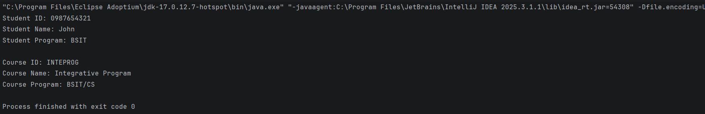

# OOP Enrollment System

---

**Author**: Manalo, Aryl Ross A.

**1. Description**
- This contains the base data model for the enrollment system using objective oriented programming. 
- The current code contains the base data models that are needed for this system
- Key data such as Student  ID, Student Name, and Student Program
- The OOP Principles applied are Constructors and Encapsulation.

Image: 

Inheritance Proof: 

Person: 
Student: 
Instructor: 

Abstraction:
Person:
Student:
Instructor:
